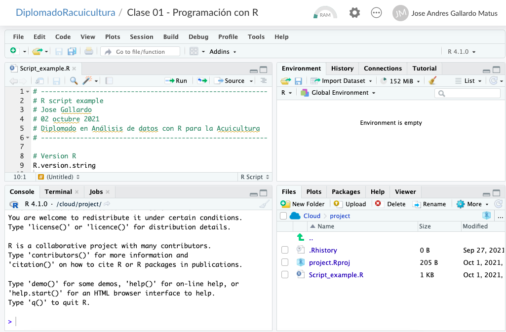

```{r setup, include=FALSE, comment=TRUE}
knitr::opts_chunk$set(echo = FALSE)
```

## **PLAN DE CLASE**

**1).** **Introducción**


- ¿Qué es R y Rstudio?

- ¿Por qué usar R para el análisis de datos?

- R en investigación reproducible.

**2).** **Práctica con R y Rstudio (cloud)**


- Iniciar un proyecto de análisis de datos con R.

- Familiarizarse con manipulación de objetos y datos.


## **¿QUÉ ES R?**

**1).** **R** es un lenguaje y entorno de programación de código abierto o libre creado por Ross Ihaka y Robert Gentleman en 1993 (University of Auckland) para realizar análisis estadísticos y gráficos.


**2).** Los usuarios de R tienen la libertad de ejecutar, copiar, distribuir, estudiar, modificar y mejorar el **_software_**.

**3).** Utilizar **R** supone un ahorro económico para los estudiantes, las instituciones educativas o incluso las empresas que decidan usarlo.


## **¿POR QUÉ USAR "R"?**

- Aprender a usar **R** te da **_independencia digital_**, te permite **_cooperar con otros_** y **_beneficiarte de la ayuda de otros._**

- Actualmente existen cerca de **17.000 librerías o apps** disponibles de forma gratuita para trabajar con R en ámbitos tan diferentes como las ciencias sociales, la economía, la astronomía, la ingeniería y las biociencias.

- **R** permite entonces difundir el conocimiento a toda la sociedad y no solo a los que pueden pagar por ella.


## **BENEFICIOS DE USAR R EN BIOCIENCIAS**

- **Permite la ejecución de tareas de análisis repetitivo sin esfuerzo.**
- Muy fácil corregir y regenerar resultados, tablas y figuras.
- **Reducción drástica del riesgo de errores.**
- Facilita la colaboración.
- **Mayor facilidad para escribir reportes y publicaciones.**
- Facilita el proceso de revisión por pares.
- **Ahorro de tiempo y esfuerzo al reutilizar código en otros proyectos.**


## **R EN INVESTIGACIÓN REPRODUCIBLE**

Trabajar con R permite realizar **Investigación reproducible**. 
La investigación reproducible implica que desde los mismos datos y códigos se generarán los mismos resultados.

```{r, echo=FALSE, out.width = '100%' }
knitr::include_graphics("Investigacion_reproducible.png")
```

## **ALGUNOS CRITERIOS DE REPRODUCIBILIDAD**

- **Los datos originales están disponibles en la nube.**
- Los datos están almacenados en formato abierto (texto) .
- **Todo el análisis y manejo de datos se hace mediante código.**
- El código genera las tablas y figuras finales.
- **Los datos brutos están separados de los datos derivados.**
- Existe un **_‘script’_** maestro que ejecuta todos los pasos del análisis ordenadamente.
- **Existe un documento README que explica los objetivos y organización del proyecto.**
- Tanto el reporte, como los datos y código son públicos.


## **RUTA DEL ANÁLISIS DE DATOS REPRODUCIBLE CON R**

**1. Toma de datos.**    
Es importante estandarizar y mantener estructura.   
**2. Manipulación de datos.  **
Es importante cuidar los datos originales, trabajaremos con R + Rstudio  
**3. Análisis datos integrado con texto.  **
Facilita la colaboración, trabajaremos R + Rstudio + RMarkdown  
**4. Publicar resultados.  **
Es importante comunicar de forma efectiva.


## **CONCEPTOS BÁSICOS DE PROGRAMACIÓN**

\columnsbegin
\column{.8\textwidth}

**Metáfora de la maquina expendedora de bebidas**  
\
&nbsp;

1. La máquina tiene una función específica.

2. Los productos son objetos almacenados de forma ordenada.

3. Los objetos tienen características (Nombre, precio, ubicación).

4. Para comprar debo seguir una secuencia de pasos (similar a un programa = códigos en secuencia).

\column{.3\textwidth}
```{r, echo=FALSE, out.width = '90%' }
knitr::include_graphics("maquina_1.png")
```

\columnsend


## **R ES UN LENGUAJE ORIENTADO A OBJETOS**

**Tipos de objetos para trabajar con R**

```{r, echo=FALSE, out.width = '100%' }
knitr::include_graphics("ObjetosR.png")
```

## **OBJETO: DATA.FRAME**

**Principales características.**  
\
&nbsp;

- Objeto similar a una tabla de datos.  
- Almacenan texto o números.  
- Primera fila contiene el nombre de las variables.  
- Puedo unir con otro **data.frame**.  
- Puedo aplicar funciones para calcular estadísticos.  
- Pero, no tiene atributos de una matriz, ni de un vector, ni es una serie de tiempo.  

## **¿QUÉ ES R STUDIO?**


* **Rstudio** es el más popular entorno de desarrollo integrado (integrated development environment, IDE) para trabajar con **R**.

* **Rstudio** es un **_software_** libre y de código abierto creado por **Joseph J. Allaire en 2009** para la ciencia de datos, la investigación científica y la comunicación técnica.

* Actualmente es mantenido por la Corporación de Beneficio Público **Rstudio PCB**, la que ha creado otros software como Rmarkdown.


## **EJEMPLO RSTUDIO - VERSION CLOUD**

```{r, echo=FALSE, out.width = '100%' }

```

## **PRÁCTICA CON R Y RSTUDIO.CLOUD**

**1).** **Guía de trabajo programación con R disponible en drive.**

**2).** **La tarea se realiza en Rstudio.cloud**.

## **RESUMEN DE LA CLASE**


* Ruta del análisis de datos reproducible con **R**.

* Iniciamos un proyecto de análisis de datos con **R**.

* Escribimos un código de programación de **R** con **Rstudio cloud**.

* Nos familiarizamos con la manipulación de objetos.


