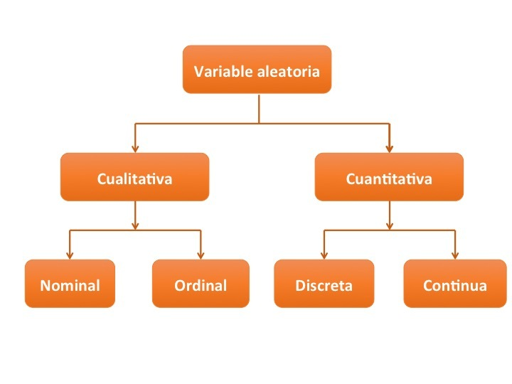
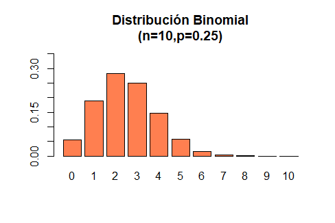
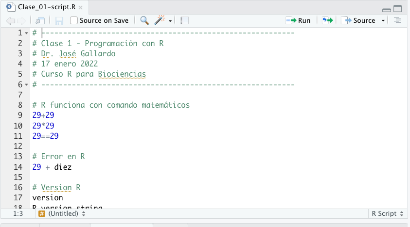

```{r setup, include=FALSE}
knitr::opts_chunk$set(echo = FALSE)
library(MASS)
library(psych)
library("knitr")
library(Rlab)
```


## **PLAN DE LA CLASE**

**1.- Introducción**

- Clasificación de variables aleatorias.
- Observar y predecir variables cuantitativas continuas y discretas.
- ¿Qué es un script?
- Formato correcto para importar datos a R.

**2.- Práctica con R y Rstudio cloud**

- Elaborar un script de R e importar datos desde excel.

- Observar y predecir variable aleatoria con distribución Normal.

- Observar y predecir variables aleatorias discretas con distribución Bernoulli o Binomial.

## **TIPOS DE VARIABLES ALEATORIAS**

```{r, echo=FALSE, out.width = '80%', fig.align='center'}

```

## **VARIABLE ALEATORIA CUANTITATIVA CONTINUA**

**Definición:** Puede tomar cualquier valor dentro de un intervalo (a,b), (a,Inf), (-Inf,b),(-Inf,Inf) y la probabilidad que toma cualquier punto es 0, debido a que existe un número infinito de posibilidades.

```{r, echo=FALSE, out.width = '70%', fig.align='center'}
knitr::include_graphics("FxNormal.jpg")
```

## **OBSERVAR UNA VARIABLE CUANTITATIVA CONTINUA**

Al observar con un histograma **hist()** notamos que: 

1. La frecuencia o probabilidad en un intervalo es distinta de cero.  
2. Cuando aumenta el **n** muestral se perfila una distribución llamada **normal**.    

```{r, echo=FALSE, out.width = '70%', fig.align='center'}
par(mfrow=c(1,2))
set.seed(123)
q<-rnorm(50, 0, 1)
hist(q, col="red", main = "Histograma n= 50", xlab = "Variable cuantitativa continua")
q1<-rnorm(10000, 0, 1)
hist(q1, col="red", main = "Histograma n= 10000", xlab = "Variable cuantitativa continua")
```

## **PREDECIR UNA VARIABLE CUANTITATIVA CONTINUA**

Podemos predecir la probabilidad de que la variable aleatoria tome un determinado valor usando la función de densidad empírica **density()**.

```{r , echo=FALSE, out.width = '80%', fig.align='center'}
q2<-rnorm(100000, 0, 1)
plot(density(q2), main = "Función de densidad empírica")

```

## **PREDECIR VARIABLES CONTINUAS 2**

Podemos predecir la probabilidad de que la variable aleatoria tome un valor menor o igual a un determinado valor, usando la función de distribución empírica acumulada **ecdf()**.

```{r}
 
plot(ecdf(q2),main= "Función de distribución empírica acumulada", col="red")
```

## **OBSERVAR CON BOXPLOT**

Las gráficas de cajas y bigotes (**boxplot()**) son muy adecuadas para observar variables aleatorias continuas.

[^1]: **IQR =** **_Rango intercuantílico_** es la diferencia entre el tercer cuartil (75%) y el primer cuartil (25%) de una distribución.

```{r, echo=FALSE, out.width = '80%', fig.align='center'}

knitr::include_graphics("Boxplot.png")
```

## **VARIABLES ALEATORIAS DISCRETAS**

Las variables aleatorias discretas son aquellas que presentan un número contable de valores; por ejemplo:

* **Número de parásitos** (1, 3, 5, 6, etc.).

* **Número de especies**.

* **Número de crías vivas o hijos o huevos**.

* **Número de semillas**.

## **IMPORTANCIA DE IDENTIFICAR Y ANALIZAR VARIABLES ALEATORIAS DISCRETAS**

* Es importante identificar la naturaleza que tiene nuestra variable en estudio, y así evitar errores en los análisis estadísticos que llevemos a cabo. 

* Usualmente cuando las variables en estudio son conteos, proporciones o binarias (éxito o fracaso, macho o hembra, sano o enfermo) deben ser consideradas como **variables aleatorias discretas**. 

* Según sea la variable aleatoria discreta, ella tendrá una función de distribución de probabilidad asociada que no es normal. Por ejemplo: **Bernoulli, Binomial, Binomial Negativa, Poisson, entre otras**. 

* En gran parte, la **_distribución de variables aleatorias discretas_** suelen ser **asimétricas a derecha o a izquierda**.


## **EJEMPLO VARIABLE ALEATORIA BINARIA - DISTRIBUCIÓN BERNOULLI**

Se realiza una prueba aleatoria de COVID-19 en los pasajeros de un avión (160 pasajeros en total) determinando que 8 de ellos son positivos. Sea X=1 si la persona tiene PCR+ y X=0 en el caso de que el PRC-. ¿Cuál es la distribución de X?. 8/160 = éxito, 152/160 = fracaso.

|             | Fracaso | Éxito |
|-------------|---------|-------|
| x           | 0       | 1     |
| f(x)=P(X=x) | 1-p     | p     |
|             | 0.95    | 0.05  |

```{r, echo=FALSE, out.width = '70%', fig.align='center'}

knitr::include_graphics("fbernoulli.png")
```

## **EJEMPLO VARIABLE ALEATORIA DISCRETA - DISTRIBUCIÓN BINOMIAL**

```{r, echo=FALSE, out.width = '80%', fig.align='center', fig.cap="Número de parásitos por animal/planta"}

```
## **¿QUÉ ES UN SCRIPT?**

Los **_scripts_** son documentos de texto con una secuencia de comandos que permiten ejecutar programas.

Estos archivos son iguales a cualquier documentos de texto, pero **R puede leer y ejecutar** el código que contienen.

Los códigos de **R** están contenidos en librerías o packages.

Algunos **_script_** que usaremos en este curso tienen extensión de archivo **.R**, por ejemplo mi_script.R o **.Rmd** (R+markdown) por ejemplo reporte.Rmd.

## **EJEMPLO DE SCRIPT R**

```{r, echo=FALSE, out.width = '100%' }

```

## **FORMATO CORRECTO PARA IMPORTAR A R**

```{r, echo=FALSE, out.width = '55%', fig.align='center', fig.cap="Formato correcto de archivo excel para que sea importado a R"}
knitr::include_graphics("Excel_ok.png")
```

## **ERRORES EN FORMATO EXCEL**
```{r, echo=FALSE, out.width = '80%', fig.align='center', fig.cap="Errores comunes antes de importar a excel"}
knitr::include_graphics("Errores_1.png")
```

**Importante:** No colocar símbolos matemáticos por ejemplo (%,$,+) como nombres de las **(variables)**.

## **ERRORES EN FORMATO EXCEL 2**
```{r, echo=FALSE, out.width = '80%', fig.align='center', fig.cap="Errores comunes antes de importar a excel"}
knitr::include_graphics("Errores.png")
```

**Importante:** No colocar comentarios en las celdas de datos. Dejar celdas vacias o usar el simbolo *NA* es preferido cuando hay datos faltantes.

## **COMO IMPORTAR DATOS EXCEL A R**

Antes de importar un archivo en formato excel (**.xlsx o .xls**) debe instalar y tener habilitada la librería **readxl**

```{r, echo=TRUE, out.width = '100%', fig.align='center'}
library(readxl)
dat <- read_excel("Data.xlsx", sheet = 1)
dat <- read_excel("Data.xlsx", sheet = "Poblacion 1")
```

## **PRÁCTICA ANÁLISIS DE DATOS**

1.- Guía de trabajo Rmarkdown disponible en drive.  

2.- La tarea se realiza en Rstudio.cloud.

## **RESUMEN DE LA CLASE**

- Identificamos  y clasificamos variables aleatorias.

- Observamos la distribución de una variable cuantitativa continua usando histograma y boxplot.

- Predecimos el comportamiento de una variable cuantitativa continua con distribución normal usando funciones de densidad y de distribución acumulada.

- Estudiamos sobre variables aleatorias discretas y algunas distribuciones de probabilidad asociadas (Bernoulli y Binomial).

