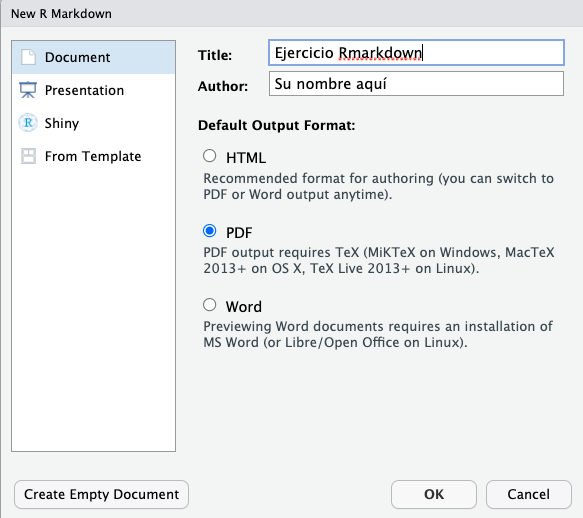

<style>
#TOC {
  color: black;
  font-familiy: Calibri;
  font-size: 14px;
  border-color: #708090; 
}
body {
   color: black;
   font-familiy: Calibri;
}

pre {
  color: black;
  background-color: #F8F8FF;
}
# header {
  color: #800000;
  font-familiy: Calibri;
  background-color: #F5F5F5;
  opacity: 0.8;
  font-size: 16px;
}
</style>

### **Introducción**

¿Qué es Rmarkdown?

**Markdown** es un lenguaje de marcado ligero creado por John Gruberis en 2004, con el se pueden elaborar fácilmente documentos en formato HTML, PDF y MS Word. Para más detalles de como trabajar con Markdown explore el siguiente link  <https://es.wikipedia.org/wiki/Markdown>.

[**Rmarkdown**](https://rmarkdown.rstudio.com/) es un procesador de texto que permite la creación de reportes, informes, documentos o presentaciones de alta calidad para sus usuarios o clientes. RMarkdown no sería posible de imaginar sin el desarrollo previo y la integración de varios **_software_** como **Markdown** y **YAML** o librerías de **R** como **knitr**.

Una de las versatilidades de **Rmarkdown** es que puede pasar de análizar sus datos, a realizar un reporte profesional para sus usuarios o clientes sin necesidad de copiar o pegar a otro documento o usar otro software. 

[**_knitr_**](https://yihui.org/knitr/) es la librería clave que utliza **Rmarkdown** puede generar reportes dinámicos. **knitr** fue desarrollada por Yihui Xie en 2012 y su contribución a la investigación reproducible ha sido significativa.

**[YAML](https://es.wikipedia.org/wiki/YAML)** es un lenguaje simple de programación que permite describir datos. Se usa como herramienta para configurar el **metadata** de un reporte dinámico en Rmarkdown. 

**¿Cómo funciona?**

Respecto de un **_script_** tradicional de **R**, los script de Rmarkdown presentan tres diferencias: 

**1**. La extensión del archivo es **.Rmd**.

**2**. La codificación de la metadata está a cargo del software **YAML** y le indica a **knitr** no sólo que tipo de documento generar (Html, word, pdf, PPT); sino también, cual será el formato global y específico del documento (tamaño de letra, color, etc).

**3**. Los códigos se deben incluir en bloques, también llamados **Chunk**. Los chunk pueden tener un nombre identificador y mediante algunos argumentos específicos definir las características de ese bloque en particular, como por ejemplo, que el código se incluya o no en el reporte, o para agregar alguna leyenda a las figuras.


### **Objetivos de aprendizaje**

Los objetivos de aprendizaje de esta guía son:

**1**. Iniciar un proyecto de análisis de datos y escribir un código de programación o **_script_** con **[Rmarkdown](https://rmarkdown.rstudio.com/)**.

**2**. Elaborar reportes dinámicos con **Rmarkdown**.


## **Ejercicios**

## **Ejercicio 1.** **Conociendo un script de Rmarkdown**

Abra el archivo *Rmarkdown_example.R* disponible en Rstudio.cloud y revise su estructura.   

Note detalladamente la importancia de establecer con claridad los **metadatos** del script y como ahora están escritos en un formato diferente de un script de R tradicional, llamado **YAML**.    

Distinga el texto de bajo nivel o **markdown** de los bloques de códigos **chunk**. Tome un tiempo y discuta con sus compañeros cuál es la función de los comandos y argumentos que se incluyen en el ejemplo.

Para finalizar, compile el código con el botón **knit** e imprima diferentes reportes del mismo documento en formato pdf, html y word.

## **Ejercicio 2.** **Cree su propio reporte de análisis de datos con Rmarkdown**

Ahora, cree su propio **_script_** para elaborar un reporte usando la barra de herramientas de **Rstudio**. Seleccione **File > New file > R Markdown** y utilice el siguiente ejemplo para completar la información de **metadatos**: Título, nombre del autor y formato, seleccione pdf.

```{r, echo=FALSE, out.width = '55%' }

```

Luego guarde inmediatamente su script como **script_6_nombre_apellido.Rmd**.  

## **Ejercicio 3.** **Trabajando con la plantilla de Rmarkdown** 

**a).** Tómese un tiempo en reconocer la estructura del archivo que se ha creado. Identifique donde está el metadata de **YAML** y que tipo de reporte genera el script. Identifique el texto de bajo nivel y los bloques de código de la plantilla que Rstudio.

## **Ejercicio 4.** **Configuración del reporte**

En el primer bloque de códigos o **chunk** asegúrese de que los comandos están configurados de la siguiente manera *knitr::opts_chunk$set(echo = TRUE)*. Luego a mode de prueba cargue la librería **stats** usando la función library().

```{r setup, include=TRUE, warning=FALSE, message=FALSE}
knitr::opts_chunk$set(echo = FALSE)
library(stats)
```


## **Ejercicio 5.** **Borrar información de la plantilla**

Borre los siguientes bloques de códigos R y el texto que se generó automáticamente con la plantilla y reemplacelos por nuevos bloques de códigos con el botón verde **+C** que se encuentra en la parte superior del panel de códigos. 

Ejecute cada uno de los siguientes ejercicios en uno o más bloques de códigos diferentes o en el texto de bajo nivel según sea el caso. Sea ordenado y documente su reporte adecuadamente.

## **Ejercicio 6.** **Escriba una introducción para el set de datos BOD usando markdown**

Usando el comando help(), busque información del set de datos BOD y escriba al inicio de su reporte una breve descripción de este set de datos. Recuerde usar # para crear el título de la Introducción.

## **Ejercicio 7.** **Incluir tablas con markdown**

Incluya y describa en su introducción la siguiente tabla de datos (BOD) usando markdown. Note que **Time** está justificado a la izquierda (:--) y **demand** a la derecha (--:).

    | Time | demand |
    | :-- | --: |
    |1	| 8.3 |			
    |2	| 10.3 |			
    |3	| 19.0	|		
    |4	| 16.0	|		
    |5	| 15.6	|		
    |7	| 19.8	|

## **Ejercicio 8.** **Incluir tablas con el comando kable**

Usando el set de datos BOD incluya ahora la misma tabla anterior pero esta vez usando este comando **knitr::kable()**. Use el argumento *caption =""* para agregar la leyenda de la tabla. Compare con el resultado anterior.

```{r}
knitr::kable(BOD, caption = "**Tabla 1.** Bemanda bioquímica de oxígeno")
```

### **Ejercicio 9.** **Grafique con Rmarkdown**

En uno de los bloques de códigos que creo anteriormente escriba los comandos necesarios para replicar la siguiente figura. Busque en google como añadir colores a un plot, como cambiar los simbolos con los argumentos **col=**, **bg=**, **pch=** y **cex=**. Puede agregar la leyenda de la figura usando el argumento **fig.cap=""** dentro de la primera línea del bloque de códigos.

```{r, fig.cap="Demanda bioquímica de oxigeno"}
plot(BOD$Time ~ BOD$demand, xlab = "Time (days)", ylab = "Demand (mg/l)", 
     col="black", pch=22, bg="red", cex = 2)
```

### **Ejercicio 10.** **Imprimir reportes dinámicos**

Finalmente imprima diferentes versiones de su reporte (pdf, word, html) con el botón **Knit**.

Use esta [Hoja de referencia](https://github.com/rstudio/cheatsheets/raw/master/translations/spanish/rmarkdown-2.0_Spanish.pdf) como ayuda para elaborar reportes Rmarkdown.

Use está guía de sintaxis de **Markdown** para mejorar el estilo de sus documentos [Rmarkdown](https://rstudio-pubs-static.s3.amazonaws.com/330387_5a40ca72c3b14824acedceb7d34618d1.html).
