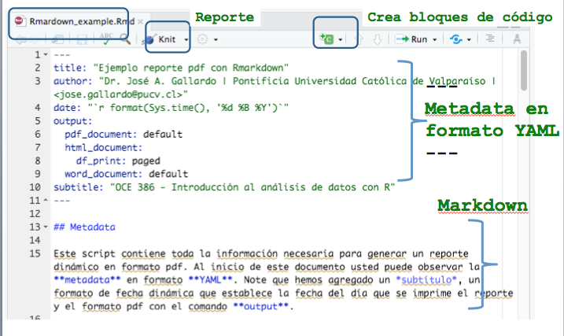
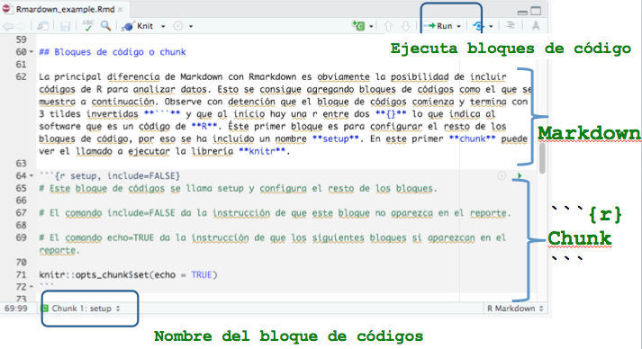

```{r setup, include=FALSE, comment=TRUE}
knitr::opts_chunk$set(echo = FALSE)
```

## **PLAN DE CLASE**

**1).** **Introducción**

- **Pruebas no paramétricas**

- **¿Qué es Rmarkdown y para que sirve?**

- **¿Cómo funciona?**


**2).** **Práctica con R y Rstudio cloud**

- **Escribir un código de programación con Rmarkdown.**

- **Elaborar reportes dinámicos de análisis de datos con Rmarkdown.**

## MÉTODOS NO PARAMÉTRICOS

Conjunto diverso de pruebas estadísticas.

El concepto de “no paramétrico” a veces es confuso, pues los métodos no paramétricos si estiman y someten a prueban hipótesis usando parámetros, pero no los de distribución normal.

Se aplican usualmente para variables cuantitativas que no cumplen con el supuesto de normalidad y para variables cualitativas.

## SUPUESTOS: MÉTODOS NO PARAMÉTRICOS

El principal supuesto de los métodos no paramétricos es que las variables aleatorias son independientes y con idéntica distribución.

Usualmente no tienen supuestos acerca de que tipo de distribución tiene la variable, alternativamente se conocen como métodos de distribución libre.

## PRUEBA DE CORRELACIÓN NO PARAMÉTRICA - SPEARMAN

**¿Para que sirve?**    
Para estudiar asociación de dos variables, cuando no se cumple uno o varios supuestos de la correlación paramétrica:    
- Las variables X e Y no son continuas.  
- No existe relación lineal.  
- La distribución conjunta de (X, Y) no es una distribución Bivariable normal.  

|  **Hipótesis** | **Verdadera cuando**| 
|:-------------|:------------------|
| **H~0~**: X e Y mutuamente independientes | $\rho$ = 0|
| **H~1~**: X e Y no son mutuamente independientes | $\rho$ $\ne$ 0|

*Coeficiente de correlación de Spearman ($\rho$ = rho)*

## EJEMPLO FUNCIÓN MONÓTONA

**¿Cuál es el supuesto que no se cumple?**  

```{r, out.width = '80%' }
# No existe una relación lineal

set.seed(123)
x <- 1:20
y <- (1/4) * x^2 # Funcion monotona creciente

plot(x, y, type = 'b', main = 'Relación no lineal', frame.plot = FALSE, col = "dark red", lwd=2, font=2, cex.axis = 1.5)
```

## EJEMPLO VARIABLES DISCRETAS U ORDINALES

**¿Cuál es el supuesto que no se cumple?**  

```{r, out.width = '80%' }
# Parásitos es variable discreta.

set.seed(0)
x <- trunc(runif(200)*10)
y <- x * 3 + trunc(runif(200)*10)
plot(y,x,pch=16, xlab = "Tamaño del pez", ylab = "parásitos", col = "red")
```

## PRUEBA DE WILCOXON PARA DOS MUESTRAS INDEPENDIENTES

**¿Para qué sirve?**   
Para comparar dos muestras con idéntica distribución, con diferentes medianas y sin normalidad.
Usualmente para variables discretas.

::: columns

:::: column

```{r, echo=FALSE, out.width = '120%' }
knitr::include_graphics("No_par.png")
```

::::

:::: column

|  **Hipótesis** |
|:-------------:|
| **H~0~**: Tratamiento = Control |
| **H~1~**: Tratamiento > Control | 

::::

:::

## PRUEBA DE WILCOXON PARA DOS MUESTRAS PAREADAS

**¿Para que sirve?**   
Para comparar dos muestras *pareadas* con idéntica distribución, con diferentes medianas y sin normalidad.

::: columns

:::: column
```{r, echo=FALSE, out.width = '120%' }
knitr::include_graphics("pareadas.png")
```

::::

:::: column

|  **Hipótesis** |
|:-------------:|
| **H~0~**: d = 0 |
| **H~1~**: d > 0 | 

::::

:::

## PRUEBA DE KRUSKAL-WALLIS PARA MÚLTIPLES MUESTRAS INDEPENDIENTES

**¿Para que sirve?**   
Para comparar múltiples muestras con idéntica distribución, con diferentes medianas y sin normalidad.

```{r, echo=FALSE, out.width = '60%' }
knitr::include_graphics("multiple.png")
```

|  **Hipótesis** |
|:-------------:|
| **H~0~**: La distribución de los k grupos son iguales. |
| **H~1~**: Al menos 2 grupos son distintos. | 


## **EXISTEN DISTINTAS FORMAS DE CREAR REPORTES**

- **What You See Is What You Get**  
Microsoft Word, Microsoft Power Point,formato de documento portátil (pdf)

- **What You See Is What You Mean**.  
Latex, Markdown, HTML, Rmarkdown


```{r, echo=FALSE, out.width = '100%' }
knitr::include_graphics("Rmarkdown.png")
```

## **¿QUÉ ES R MARKDOWN?**

Rmarkdown es un procesador de texto que permite la creación de reportes de alta calidad. 

```{r, echo=FALSE, out.width = '100%' }
knitr::include_graphics("Reportes.png")
```

## **VENTAJAS DE USAR RMARKDOWN?**

- Es un software libre y de código abierto, por lo que podemos usarlo sin necesidad de comprar una licencia.

- Permite trabajar bajo el paradigma de la investigación reproducible (texto sin formato).

- Cualquiera puede crear reportes, documentos, presentaciones y libros de alta calidad, con poco esfuerzo.

- Uno de los mejores sistemas para crear reportes colaborativos y mejorar el rendimiento del trabajo de los analistas de datos. 

## **¿CÓMO FUNCIONA R MARKDOWN? 1 **

```{r, echo=FALSE, out.width = '100%' }

```


## **¿CÓMO FUNCIONA R MARKDOWN? 2**

```{r, echo=FALSE, out.width = '100%' }

```


## **PRÁCTICA CON RMARKDOWN**

**1).** **Guía de trabajo programación con Rmarkdown disponible en drive.**   

**2).** **La tarea se realiza en Rstudio.cloud**.   


##  **RESUMEN DE LA CLASE**

- Comunicar resultados de forma efectiva.

- Ventajas de la elaborar reportes dinámicos con Rmarkdown.

- Escribir un código de programación con Rmarkdown.

- Elaborar diferentes reportes dinámicos.

